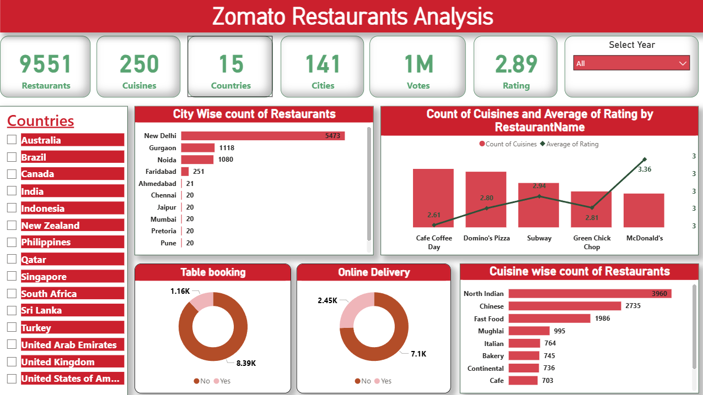

# Zomato Insights Dashboard

A Power BI dashboard project analyzing Zomato data to uncover insights about restaurant ratings, locations, cuisines, and pricing.

## 📊 Dashboard Preview

Here is a screenshot of the main dashboard:

*(Note: If you named your screenshot something different, change `dashboard-preview.png` to your file's name.)*

## 🚀 Key Features & Insights

This dashboard interactively analyzes:

* **Geographical Distribution:** Number of restaurants by country and city.
* **Ratings & Cost:** Analysis of restaurant ratings, votes, and average cost for two.
* **Cuisine Analysis:** Most popular cuisines and their prevalence.
* **Delivery & Booking:** Filters for restaurants that offer online delivery or table booking.

## 💾 Data Source

This project uses the following data files:

* `zomato_data.xlsx - Sheet1.csv`: The main dataset containing detailed restaurant information.
* `zomato_data.xlsx - Sheet2.csv`: A lookup table for country codes.

*(Optional: Add a sentence about where you got the data, e.g., "This dataset was sourced from Kaggle.")*

## 🛠️ Tools Used

* **Power BI Desktop:** Used for data modeling, creating DAX measures, and building the interactive report.

## ⚙️ How to Use

1.  **Download** this repository (or just the `.pbix` file).
2.  **Open** the `Zomato_Insights_Dashboard.pbix` file using [Power BI Desktop](https://powerbi.microsoft.com/en-us/desktop/).
3.  **Interact** with the dashboard! All data is imported into the Power BI file, so no additional setup is needed.

A Power BI dashboard for Zomato insights.
